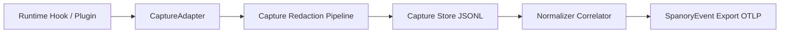
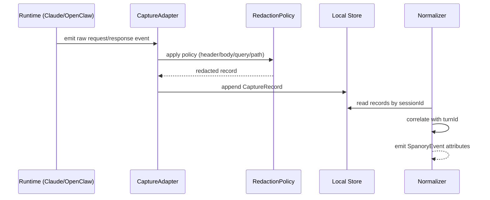

# Spanory 多 Runtime 抓包设计（Phase 2 输入）

## 1. 目标与边界
- 目标：为 `Claude Code` 与 `OpenClaw` 提供统一抓包能力，补齐 transcript 之外的请求/响应上下文，用于排障与质量分析。
- 本文只定义架构与契约，不实现抓包代码。
- 关键原则：默认关闭、显式开启、最小可见面、可回退。

## 2. 总体架构

### 2.1 组件职责
- Runtime Hook / Plugin：从运行时侧采集原始请求、响应、工具调用事件。
- CaptureAdapter：屏蔽 runtime 差异，输出统一 `CaptureRecord`。
- Capture Redaction Pipeline：执行脱敏、截断、二进制丢弃策略。
- Capture Store：按 `sessionId` 分片写本地 JSONL，供 replay/backfill 读取。
- Normalizer Correlator：把抓包记录与 transcript turn 关联，生成可观测属性。

## 3. 生命周期与时序

## 4. 接口契约（已在 core 类型声明）

### 4.1 `CaptureRecord`
- 统一字段：`runtime/sessionId/projectId/turnId/timestamp/channel/direction/name/payload/metadata`。
- `channel` 约束：`http | stdio | file | hook`。
- `direction` 约束：`request | response | event`。

### 4.2 `CaptureAdapter`
- `enabled(context)`：运行时是否启用抓包。
- `startSession(context)`：会话级初始化（可选）。
- `capture(record, context)`：核心写入入口。
- `flush(context)`：会话结束落盘（可选）。

### 4.3 `CaptureRedactionPolicy`
- `enabled`：是否启用脱敏。
- `mode`：`allowlist | denylist`。
- `rules[]`：按 `header/query/body/path` 匹配并替换。
- `maxPayloadBytes`：单条 payload 截断上限。
- `dropBinary`：二进制内容直接丢弃。

## 5. 配置与开关策略
- 默认关闭：`SPANORY_CAPTURE_ENABLED` 未设置或非 `1/true` 时不抓包。
- 显式开启：用户设置 `SPANORY_CAPTURE_ENABLED=1` 后生效。
- runtime 粒度开关：
  - `SPANORY_CAPTURE_CLAUDE_ENABLED`
  - `SPANORY_CAPTURE_OPENCLAW_ENABLED`
- 回退策略：
  - 抓包失败不影响主链路 export/hook。
  - 记录 `capture.error.count` 并降级为 transcript-only。

## 6. 安全边界与脱敏
- 脱敏必须在落盘前执行，禁止“先写盘后清洗”。
- 默认 denylist 建议覆盖：`authorization`、`cookie`、`set-cookie`、`x-api-key`、`token`、`password`。
- 对 body/query 采用关键路径匹配（例如 `credentials.password`）。
- 长文本与二进制通过 `maxPayloadBytes` 与 `dropBinary` 控制，避免泄露与磁盘膨胀。

## 7. 首期接入路径

### 7.1 Claude Code
- 接入点：现有 hook 命令前后（request/response）与工具调用输出。
- 关联键：`sessionId + timestamp + tool_call_id`。
- 目标：补齐 transcript 不含的请求参数、工具返回片段与失败细节。

### 7.2 OpenClaw
- 接入点：plugin runtime 的事件总线（message/toolCall/toolResult）。
- 关联键：`sessionId + message.id/toolCallId`。
- 目标：在 replay/backfill 中复用同一抓包格式，无需单独编译路径。

## 8. 失败模式与监控信号
- 写盘失败（权限/空间）：计数并降级，输出 `capture.store.write_error`。
- 脱敏规则异常：计数并降级，输出 `capture.redaction.error`。
- 关联失败（找不到 turn）：保留原记录并标注 `capture.unmatched=true`。
- 监控指标建议：
  - `capture.records.total`
  - `capture.records.dropped`
  - `capture.redaction.applied`
  - `capture.error.count`

## 9. 回退与兼容
- 未启用抓包时，行为与当前版本一致（完全兼容）。
- 启用抓包但采集异常时，自动回退 transcript-only，不阻塞 hook/backfill。
- 不引入强制新依赖，优先使用现有 Node 标准库与当前 CLI 管道。

## 10. Phase 2 实施入口任务
1. 在 CLI 增加 capture 开关解析与环境变量解析。
2. 为 Claude Code 实现最小 `CaptureAdapter`（request/response + tool）。
3. 为 OpenClaw plugin 实现最小 `CaptureAdapter`（message/toolCall/toolResult）。
4. 实现 redaction pipeline 与单元测试。
5. 扩展 normalize 关联逻辑并新增 BDD 场景（开启/关闭/降级）。
